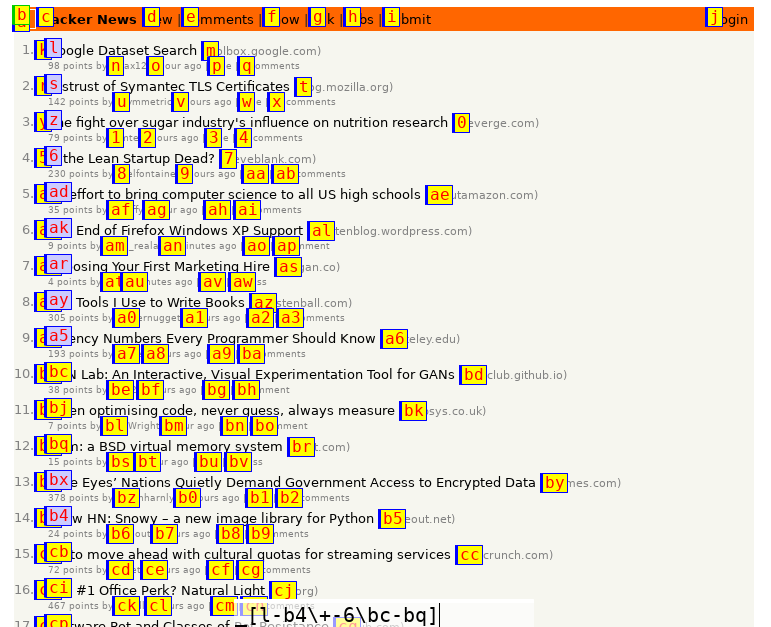
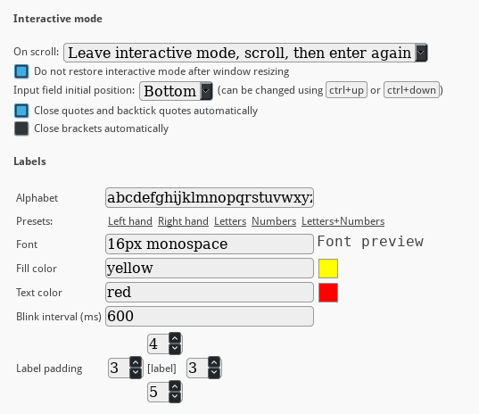
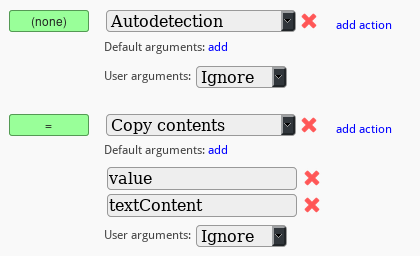
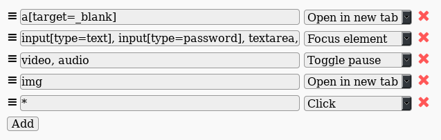
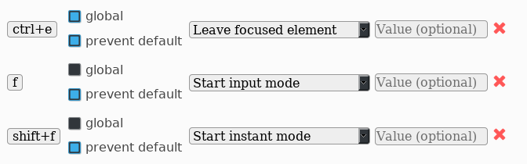
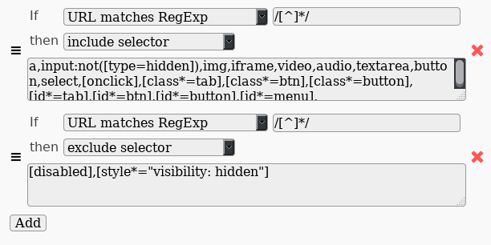
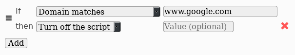
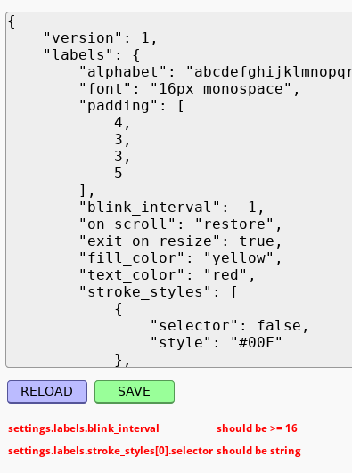

# About

`axes` ([gitlab](https://gitlab.com/axes-webext/axes/) / [addons.mozilla.org](https://addons.mozilla.org/en-US/firefox/addon/axes/)) is a [WebExtension](https://wiki.mozilla.org/WebExtensions) inspired by [Konqueror](https://konqueror.org/)'s "access keys" feature, [Uzbl Browser](https://www.uzbl.org/)'s "link following" feature and similar functionality available in [Vimperator](http://www.vimperator.org/vimperator/), [Vimium](https://vimium.github.io/), [Pentadactyl](https://addons.mozilla.org/en-US/firefox/addon/pentadactyl/) and [Tridactyl](https://github.com/cmcaine/tridactyl) addons.

The general idea of all above is to show text labels near each document link, and when the user types the characters matching one of these labels, the appropriate link receives a click. This can save a lot of time, because the user don't have to switch between mouse and keyboard.

`axes` extends and generalizes that idea.

The purpose of `axes` is to provide keyboard access to *mostly all* of the meaningful ways of interaction with *mostly all* of the element types, e.g. it is possible to select from drop-down-on-hover menus, etc.

On the picture below there is an example of how the addon can be used to open multiple links at once (note the input field at the bottom).

A *power user* may get an imposing benefit after learning a special [DSL](https://en.wikipedia.org/wiki/Domain-specific_language) created to describe element targets and ways of interaction with them. The main concepts of this language are [events](#events), [targets](#targets), [modifiers](#modifiers), [actions](#actions) and [arguments](#modifier-arguments).

# Concepts

## Events

Each event consists of exactly one [target](#targets) and a list of [modifiers](#modifiers), which can be empty. User input is a list of space-separated events.

## Targets

Targets are something the user can interact *with*, they specify lists of DOM elements. Each target can be defined using [label query](#label-queries) or [selector](#selectors).

### Label queries

Labels are small pieces of text dynamically bound to UI elements of the document that appear directly on the screen when the script is in [interactive mode](#modes). The value of label bound to a specific element is not constant and depends on scroll position and current mode.

Label queries may consist of single label or label list. Label lists must be enclosed in brackets. They may consist of a single label as well, but also may include label intervals (in form of `from-to`, where `from` and `to` are labels), other label lists (comma-separated) and exclusion expressions. Exclusion expressions allow to filter lists of labels. They are denoted with `\` (similar to [relative complement notation](https://en.wikipedia.org/wiki/Complement_(set_theory)), a set-theoritical term meaning set subtraction). On the right side of backslash character there should be a label list or an exclusion pattern. Exclusion patterns specify rules to exclude labels based on their index number. They are literally strings consisting of `+` and `-` characters, as well as numbers, that are syntactic sugar to strip away long sequences of similar plus or minus characters (the number specifies how many times the preceding character should be repeated). It should be noted that `\` is left-associative, so `a\b\c` is `(a\b)\c` and not `a\(b\c)`. Parentheses can be used when left associativity isn't wanted.

**Example:**

Let's analyze the label list on the picture above, namely `[l-b4\+-6\bc-bq]`.

First, the overall `l-b4` interval gets expanded to a list of labels. Then, the exclusion pattern filters it, leaving each seventh label starting from `l` (note that plus character is first, and `-6` expands to `------`). Then the second exclusion pattern removes the elements that fall into `bc-bq` interval, namely `bc`, `bj` and `bq`.

### Selectors

Selector targets utilize the syntax of [CSS selectors](http://www.w3schools.com/CSSref/css_selectors.asp), slightly expanding it to allow filtering and element selection by index.

Selectors should be specified in figure brackets. Selector target (despite the brackets) is either a raw CSS selector with optional index list or an exclusion expression denoted with `\`.

Index list is a comma-separated list of numbers or number intervals (e.g. `0-10`). Index list may be specified on the right side of a CSS selector, separated from it with `|` character.

Selector exclusion expressions are left-associative. It is possible to group expressions using parentheses when right associativity is needed.

**Example:** `{a|0,1-3\.someclass|1-4\a|1}` selects links (the `a` selector) with indexes 0, 2, 3, excluding the ones that have `someclass` in their class list, and also have indexes from 1 to 4 in a list of elements returned by `.someclass` selector (so the first `.someclass` element with index number 0 will not be excluded).

## Actions

Each action is a function that accepts a list of DOM elements. It also has a special color associated with it.

Some actions accept arguments. Actions do not have textual representation; there are no ways to call them other than using [modifiers](#modifiers).

See [list of all available actions](#list-of-actions) below.

## Modifiers

Modifiers were introduced to name actions efficiently and to separate the notion of action by itself from its name.

Modifiers are associated with lists of actions. Each modifier is just a single character (one of `!`, `@`, `#`, `$`, `%`, `^`, `&`, `*`, `_`, `+`, `-`, `=`, `~`, `"`, `;`, `:`, `\`, `|`, `/`, `?`, `.`, `>`, `<` and `,`) or a `` ` ``-enclosed user-defined `[a-z0-9]`-string (user can add new modifiers at the "Modifiers" section of the addon settings page).

### Modifier arguments

Argument is a single-quoted string that can be passed to a modifier by placing it right after. Quotes can be escaped with `\` character.

Modifiers accept positional arguments (e.g. `%'arg1''arg2'`).

## Modes

**Note:** both input-mode and instant-mode are being referred to as interactive-mode when the difference between them is not important.

### input-mode

When the addon is in `input-mode`, the user can see a textarea field waiting for input at the bottom, as well as labels near some of the DOM elements. If labels overlap (due to elements being too close to each other), they start blinking so that each label in each overlapping group gets to the top for some time and then fades back, repeatedly. The stroke color of each label gives the user some information about what type of element the label is bound to. Blue color means links, green means images, red means audio or video and gray means all the other types - (see `settings.labels.stroke_styles` at JSON settings). It is very common, for example, that images on websites appear wrapped in `<a>` tags, so that it would be very hard to determine which of the labels is bound to specific type of element without the stroke coloring feature.

While the user types, if the input gets incorrect, the textarea field gets highlighted with red color, and a message describing the error pops up at the top-right corner of the window. This message disappears when the input gets corrected.

### instant-mode

Instant mode is just the same as input mode, except for that the execution begins just at the time the first valid input is entered. Thus, it saves one key press when dealing with trivial user inputs.

### inactive-mode

A stub representing "no mode" state.

# Configuring

Addon settings' page sections are listed below.

## General settings

This section comprises the addon's behavior options and appearance settings.

## Modifiers

At the first column the user can see modifier names (or `(none)` for "no modifier"). Some rows of the table (the ones that represent user-defined modifiers) can be removed, while others cannot. At the second column there is a list of actions associated with modifiers on the left. Actions bound to modifiers may have any number of default arguments. Each action has its own preference regarding what to do with user-defined arguments passed to its modifier.

There are six options described in the table below:

 Option  | Description
---------|-------------
`Ignore` | Silently ignore arguments.
`Accept` | Ignore default arguments, use user-specified if any.
`Append` | Append user arguments to the end of the argument list (so that named user-specified arguments will take higher precedence).
`Prepend` | Put user arguments to the beginning of the argument list.
`Warn` | Show warning while reading the input as the user types.
`Reject` | Emit error so that it will not be possible to process the input.

Default modifiers settings are listed [here](#list-of-default-modifiers).

## Action autodetection

`Autodetection` is a special action that resolves to some other action based on a mapping from CSS selectors matching elements to  actions, as defined at the settings page. By default it is used if no other modifiers were given.

If none of the selectors match the element, nothing happens.

## Hotkeys

At the hotkeys table, on the left there is a row of buttons containing key bindings' values. Each of these values may be changed by clicking the button and then entering a new key sequence.

"Global" checkbox, if set, makes the hotkey available even if the focus currently belongs to an editable element (input, textarea, etc.)

"Prevent default" checkbox allows to suppress default effect of the hotkey (e.g. for 'ctrl+s' do not show dialog, for input fields do not change the value). However, it only affects the last key in a sequence.

The last optional field only takes effect when used with `Enter mode` options. It can be used to set the initial value of the user input field, thus shortening the way to enter a specific event sequence by a few key presses.

Default hotkeys are listed [here](#list-of-default-hotkeys).

## Element selectors

Element selectors are used to determine which elements should have labels. The syntax of CSS selectors is used.
URL-specific rules are being applied sequentially one by one. During that process, two lists of selectors are being formed, namely "include" and "exclude" lists.
Finally, the result is a list of all DOM elements that match at least one selector of the former and do not match any selectors of the latter list.

`then`-options are listed below:

 Option |	Description
--------|------------
`include selector` |	Add selector to "include" list and go to the next rule.
`exclude selector` |	Add selector to "exclude" list and go to the next rule.
`add selector and return` |	Add selector to "include" list and discard remaining rules
`set selector to` |	Ignore all preceding rules, overwrite "include" list selectors and set "exclude list" to be empty.

**Note:** adding too many `exclude selector` rules may increase startup times.

## Startup preferences

Startup preferences define how the script will behave on different URLs. It is possible to match the URL literally, by substring, by prefix substring, by domain or by regular expression. The syntax of regular expressions is identical to the [JavaScript standard](https://developer.mozilla.org/en-US/docs/Web/JavaScript/Guide/Regular_Expressions). It is possible to disable (or enable) the script, disable specific hotkeys or set the addon to enter interactive mode right after the page load. Some options (namely, `Disable hotkey`, `Start input mode` and `Start instant mode` accept optional values as strings):

- to disable a hotkey the literal string containing the binding should be used, which can be found at hotkeys settings.

- the meaning of value field when one of the two interactive mode options is selected is the same as at the [hotkeys settings](#hotkeys) - it sets the initial input.

## Keymaps

Keymaps are useful if the user has more than one input locale and doesn't want to check if the input method is set to latin every time.

There is no way to determine using JS which layout is currently active, so the only option is to blindly map the non-latin characters to the latin ones, according to the key locations on the keyboard.

Currently only `russian-computer` keymap is available.

## Editing JSON settings

Some configuration options lack corresponding UI controls at the settings page, but can be modified through a JSON editor. It is safe, because the parsed input always passes validation before use. In case of a syntax error, the cursor will be set to the position where this error appears in the editor. In case of a value error (i.e. caused by inacceptable properties' values or values of a wrong type being entered), a list of errors will appear under the textarea field, describing the exact path to the wrong value and a reason why it was rejected:

# Using

## List of actions

### Autodetection action

See [action autodetection](#action-autodetection).

### Show help

Pops up a help message with a list of hotkeys and modifiers.

### Click

Clicks the element using `.click()` method.

### Open in new tab

Opens link in a new tab if possible (and immediately switches to it). Fails on `javascript:` URLs.

If the element does not have the `href` attribute, uses `src`.

### Open in this tab

Opens link in the current tab, even if the `target=_blank` attribute is set.

If the element does not have the `href` attribute, uses `src`.

### Remove

Remove the element from DOM using `.remove()` method.

### Focus

Focuses the element. If more than one elements given, pops up a warning and focuses the last.

### Trigger events

Triggers an event using [EventTarget.dispatchEvent](https://developer.mozilla.org/en-US/docs/Web/API/EventTarget/dispatchEvent) method. Accepts list of events as arguments (`on` prefix should be omitted).

### Set value

If the element's tag is `input` and type is `checkbox` or `radio`, sets its `checked` property to either `true` (when called with non-empty first argument) or `false` (otherwise).

If the element is either `input` with `type="text"` or `textarea`, sets `value` property to the first argument.

### Download

Downloads links, images. audio and video. Pass `saveAs` as argument to open a file saving dialog. Pass any other string to use it as a file name. When both passed, ignores the former.

### Copy contents

Accepts property names as arguments. First property that is defined for the element will be used.

Available properties are:

- `value`
- `src`
- `href`
- `textContent`
- `imageData` (file contents as image file, can be pasted into a graphics editor)
- `dataURL` (resized image)
- `originalDataURL` (original file)

### Toggle pause

This action is for `<video>` and `<audio>` only.

### Mute

Toggles `.muted` property. This action is for `<video>` and `<audio>` only.

## Pasting text & quotes

When the user pastes text into the input field, the text becomes automatically escaped, so the quotes never break.

## List of default hotkeys

Hotkey | Meaning | Global | Prevents default | Value
---------|---------|------------|----------|---------
`f` | Start input mode | false | true |
`shift+f` | Start instant mode | false | true |
`f2 c` | Clear messages | true | true |
`f2 e` | Leave focused element | true | true |
`f2 2` | Start input mode | true | true |
`f2 f2` | Start instant mode | true | true |
`f2 3` | Start instant mode | true | true | =
`f2 o` | Turn off until page reload | true | true |
`f2 p` | Turn off on this page | true | true |
`f2 d` | Turn off on this domain | true | true |
`f2 h` | Show help | true | true |

## List of default modifiers

These are the defaults. If you are reading this guide inside the browser extension, refer to the actual settings.

Modifier | Meaning
---------|---------
(none) | Autodetection
`-` | Open in new tab
`_` | Open in new tab (inactive)
`~` | Open in this tab
`|` | Set value
`^` | Focus element
`,` | Click
`=` | Copy contents (value, textContent)
`\` | Copy contents (outerHTML)
`+` | Copy contents (href, src)
`*` | Copy contents (imageData)
`.` | Copy contents (originalDataURL)
`/` | Copy contents (dataURL)
`%` | Remove element
`!` | Mute media
`@` | Toggle pause
`#` | Trigger events (mouseover, mouseenter)
`$` | Trigger events (mouseleave, mouseout)
`&` | Trigger events (click)
`;` | Download url
`:` | Download url (saveAs)
`>` | Set value, Focus element
`?` | Show help
`"` | 
`<` | 
`` `nt` `` | Open in new tab
`` `it` `` | Open in new tab (inactive)
`` `sv` `` | Set value
`` `fs` `` | Focus element
`` `cc` `` | Copy contents (value, textContent)
`` `cs` `` | Copy contents (href, src)
`` `ci` `` | Copy contents (imageData)
`` `cu` `` | Copy contents (originalDataURL)
`` `rm` `` | Remove element
`` `mt` `` | Mute media
`` `ps` `` | Toggle pause
`` `dl` `` | Download url
`` `sa` `` | Download url (saveAs)

# Development

## Building

Dependencies:

- [grunt](https://gruntjs.com/) (tip: use local `./node_modules/grunt/bin/grunt` binary)
- [pandoc](http://pandoc.org/) - to embed README.md into `settings.html`.

Run `npm install && npm test && grunt pack` to get the .xpi file.

## Future plans

[A Lisp-like language interpreter](https://gitlab.com/kiniro/lang) will be plugged into the extension to allow creating custom actions and interact with DOM elements directly. The idea is to make possible to enter something like 
`(map download $ take 2 $ sortBy sizeOnScreen $ query 'img')` right into the input field or easily bind this code to a hotkey.

It will unlikely increase the extension size or decrease performance drastically, because:

- Parser, the largest part of the language bundle, is separated from the core (evaluator) and is able to run as a [background script](https://developer.mozilla.org/en-US/docs/Mozilla/Add-ons/WebExtensions/Anatomy_of_a_WebExtension#Background_scripts) - that means, for arbitrary number of content scripts (tabs), single parser can be used.
- The evaluator is tiny. It's about 1/5 of the current extension's size (both minified).
- It can be loaded only when necessary.